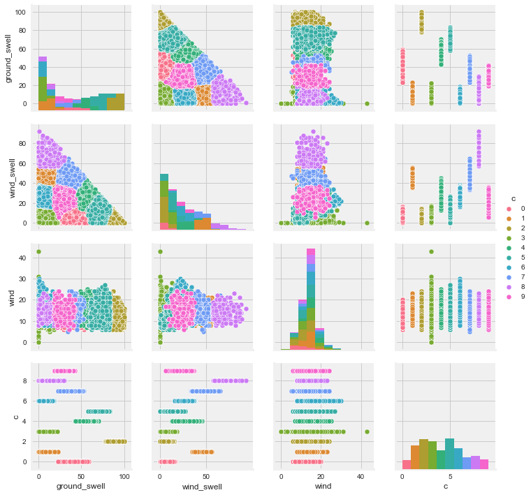

```python
import pandas as pd
import requests
import urllib2
from bs4 import BeautifulSoup
import re
import datetime
import numpy as np
import string
import matplotlib
import matplotlib.pyplot as plt
%matplotlib inline
import json
import seaborn as sns
from sklearn.cluster import KMeans
```


```python
matplotlib.style.use('fivethirtyeight')
```


```python
msw_url = 'https://magicseaweed.com'
site_map = msw_url + '/site-map.php'
```


```python
data = requests.get(site_map)
clean = data.content
soup = BeautifulSoup(clean,'html.parser')
```


```python
new_dict = {}
for region in soup.find_all('h1'):
    if re.search('Reports',region.text):
        for sub in region.find_next_sibling().find_all('a'):
            new_dict[sub.text] = sub['href'].replace('Report','Guide')

```


```python
loc_dict = {}

for region in soup.find_all('h1'):
    if re.search('Reports',region.text):
        for sub in region.find_next_sibling().find_all('a'):
            loc_dict[sub.text] = region.text.replace(' Surf Reports','')
```


```python
def seasonal_data_clean(locations):
    msw_url = 'https://magicseaweed.com'
    output_dict = {}
    for key, url_snippet in locations.iteritems():
#         print key
        spot_url = msw_url + url_snippet
        spot_site = requests.get(spot_url).content
        spot_soup = BeautifulSoup(spot_site,'html.parser')

        seasonal = spot_soup.find('div',class_='msw-s-seasonalgraph loading')
        if seasonal!=None:
            try:
                seasonal_dict = json.loads(seasonal.attrs['data-seasonal'])

                months = seasonal_dict['months']
                seasonal_data = np.array(seasonal_dict['series']).T

                try:
                    framed = pd.DataFrame(data=seasonal_data,index=months,
                              columns=['ground_swell','wind_swell','wind','wind_direction'])
                except ValueError:
                    pass

                output_dict[key] = framed
            except KeyError:
                pass
    return output_dict
```


```python
full = seasonal_data_clean(new_dict)
```


```python
full.head()
```


```python
spots = pd.DataFrame().from_dict(new_dict,orient='index')
```


```python
spots.to_csv('spots.csv',encoding='utf-8')
```


```python
df = pd.DataFrame().from_dict(output_dict,orient='index')
```

Concatenate frames


```python
# frame = pd.DataFrame()
frames = []
for k,v in output_dict.iteritems():
    f = v.copy()
    f.loc[:,'location'] = k
    f = f.reset_index()
    frames.append(f)
```


```python
total = pd.concat(frames)
```


```python
total.to_csv('annual_spot_data.csv',index=False,encoding='utf-8')
```


```python
total.loc[:,'region'] = total.location.apply(lambda x: loc_dict[x])
```


```python
total.to_csv('annual_spot_data_V2.csv',index=False,encoding='utf-8')
```


```python
total = pd.read_csv('annual_spot_data_V2.csv')
```

## EDA


```python
total.loc[:,'total_swell'] = total.ground_swell + total.wind_swell
```


```python
# total.sort_values('swell_total',ascending=False)
```


```python
total.shape
```


    (22680, 8)


```python
total = pd.read_csv('annual_spot_data_v3.csv')
```


```python
total = total[total.wind<1000]
```


```python
# inp = total[['index','ground_swell','wind_swell','wind']]
inp = total.set_index(['month','location','region','area'])
inp = inp[['ground_swell','wind_swell','wind']]
```


```python
km = KMeans(n_clusters=10)
```


```python
km.fit(inp)
```


    KMeans(algorithm='auto', copy_x=True, init='k-means++', max_iter=300,
        n_clusters=10, n_init=10, n_jobs=1, precompute_distances='auto',
        random_state=None, tol=0.0001, verbose=0)


```python
clust = pd.Series(km.labels_)
```


```python
# out1 = pd.concat([inp.reset_index(drop=True),clust.rename('c')],axis=1)
out = pd.concat([inp.reset_index(),clust.rename('c')],axis=1)
```


```python
# months = out[out.c==6].groupby('month').region.unique()
# months.to_csv('annual_plan.csv')
```


```python
# months.reset_index().region.apply(lambda x: len(x))
```


```python
# months.to_csv('regions_by_month.csv')
```


```python
# out[out.c==6].region.value_counts()
```


```python
# out[out.c==6].sort_values('wind')
# out[(out.c==6)&(out.wind<11)].groupby('month').size()
# out[(out.c==6)&(out.wind<11)].region.value_counts()
```


```python
# out[out.c==6].wind.hist(bins=20)
# out[out.c==6].plot('scatter')
# plt.scatter(out[out.c==2].wind,out[out.c==2].ground_swell)
```


```python
total[total.area=='Indian Ocean Islands']
```


<div>
<style scoped>
    .dataframe tbody tr th:only-of-type {
        vertical-align: middle;
    }

    .dataframe tbody tr th {
        vertical-align: top;
    }

    .dataframe thead th {
        text-align: right;
    }
</style>
<table border="1" class="dataframe">
  <thead>
    <tr style="text-align: right;">
      <th></th>
      <th>month</th>
      <th>ground_swell</th>
      <th>wind_swell</th>
      <th>wind</th>
      <th>wind_direction</th>
      <th>location</th>
      <th>region</th>
      <th>area</th>
    </tr>
  </thead>
  <tbody>
    <tr>
      <th>12132</th>
      <td>Jan</td>
      <td>30</td>
      <td>59</td>
      <td>15</td>
      <td>98</td>
      <td>La Ferme</td>
      <td>Rodrigues</td>
      <td>Indian Ocean Islands</td>
    </tr>
    <tr>
      <th>12133</th>
      <td>Feb</td>
      <td>32</td>
      <td>63</td>
      <td>16</td>
      <td>108</td>
      <td>La Ferme</td>
      <td>Rodrigues</td>
      <td>Indian Ocean Islands</td>
    </tr>
    <tr>
      <th>12134</th>
      <td>Mar</td>
      <td>37</td>
      <td>57</td>
      <td>16</td>
      <td>118</td>
      <td>La Ferme</td>
      <td>Rodrigues</td>
      <td>Indian Ocean Islands</td>
    </tr>
    <tr>
      <th>12135</th>
      <td>Apr</td>
      <td>49</td>
      <td>48</td>
      <td>16</td>
      <td>110</td>
      <td>La Ferme</td>
      <td>Rodrigues</td>
      <td>Indian Ocean Islands</td>
    </tr>
    <tr>
      <th>12136</th>
      <td>May</td>
      <td>60</td>
      <td>38</td>
      <td>17</td>
      <td>114</td>
      <td>La Ferme</td>
      <td>Rodrigues</td>
      <td>Indian Ocean Islands</td>
    </tr>
    <tr>
      <th>12137</th>
      <td>Jun</td>
      <td>59</td>
      <td>40</td>
      <td>19</td>
      <td>118</td>
      <td>La Ferme</td>
      <td>Rodrigues</td>
      <td>Indian Ocean Islands</td>
    </tr>
    <tr>
      <th>12138</th>
      <td>Jul</td>
      <td>52</td>
      <td>48</td>
      <td>20</td>
      <td>113</td>
      <td>La Ferme</td>
      <td>Rodrigues</td>
      <td>Indian Ocean Islands</td>
    </tr>
    <tr>
      <th>12139</th>
      <td>Aug</td>
      <td>47</td>
      <td>52</td>
      <td>20</td>
      <td>113</td>
      <td>La Ferme</td>
      <td>Rodrigues</td>
      <td>Indian Ocean Islands</td>
    </tr>
    <tr>
      <th>12140</th>
      <td>Sept</td>
      <td>53</td>
      <td>46</td>
      <td>19</td>
      <td>108</td>
      <td>La Ferme</td>
      <td>Rodrigues</td>
      <td>Indian Ocean Islands</td>
    </tr>
    <tr>
      <th>12141</th>
      <td>Oct</td>
      <td>44</td>
      <td>54</td>
      <td>17</td>
      <td>110</td>
      <td>La Ferme</td>
      <td>Rodrigues</td>
      <td>Indian Ocean Islands</td>
    </tr>
    <tr>
      <th>12142</th>
      <td>Nov</td>
      <td>49</td>
      <td>48</td>
      <td>16</td>
      <td>111</td>
      <td>La Ferme</td>
      <td>Rodrigues</td>
      <td>Indian Ocean Islands</td>
    </tr>
    <tr>
      <th>12143</th>
      <td>Dec</td>
      <td>50</td>
      <td>43</td>
      <td>15</td>
      <td>100</td>
      <td>La Ferme</td>
      <td>Rodrigues</td>
      <td>Indian Ocean Islands</td>
    </tr>
  </tbody>
</table>
</div>


```python
# total.area.value_counts() / 12
```


```python
# out[out.c==2].area.value_counts()
```


```python
sns.pairplot(out,hue='c')
```


    <seaborn.axisgrid.PairGrid at 0x1a1b805610>





```python
region_counts = total.groupby('region').location.nunique().sort_values(ascending=False)
```


```python
# region_counts[region_counts>10]
```


```python
# total[total.region=='Nova Scotia']
```


```python
stats = total.groupby('region').agg({'total_swell':['min','max','median','mean'],
                             'ground_swell':['min','max','median','mean'],
                             'wind_swell':['min','max','median','mean'],
                            'wind':['min','max','median','mean'],
                            'location':'nunique'})
```


```python
# stats.sort_values([('ground_swell','mean')],ascending=False).to_excel('regional_stats.xlsx')
stats.sort_values([('total_swell','mean')],ascending=False).to_excel('regional_stats.xlsx')
```


```python
top = stats.sort_values([('total_swell','mean')],ascending=False)[:50]
```


```python
# sns.distplot()
# sns.jointplot()
```


```python
# plt.scatter(top.loc[:,('ground_swell','mean')],top.loc[:,('wind','mean')])
# sns.jointplot(top.loc[:,('ground_swell','mean')],top.loc[:,('wind','mean')]);
```


```python
ind = pd.IndexSlice
med = top.loc[:,ind[:,'median']].reset_index()
```


```python
fin = pd.DataFrame()
for k,v in scrape.iteritems():
    df = v.copy()
    df.loc[:,'location'] = k
    df = df.reset_index()
    df.rename(columns={'index':'month'},inplace=True)
    df.set_index(['location','month'],inplace=True)
    fin = fin.append(df)
```


```python
# fin.to_csv('seasonal_data_first_cut.csv',encoding='utf-8')
fin.to_csv('full_seasonal_data.csv',encoding='utf-8')
```


```python
top = fin[(fin.wind<1000)&(fin.ground_swell>59)]
# .sort_values('ground_swell',ascending=False)
```


```python
swell_months = top.groupby(level='location').size().rename('cnt').reset_index()
```
